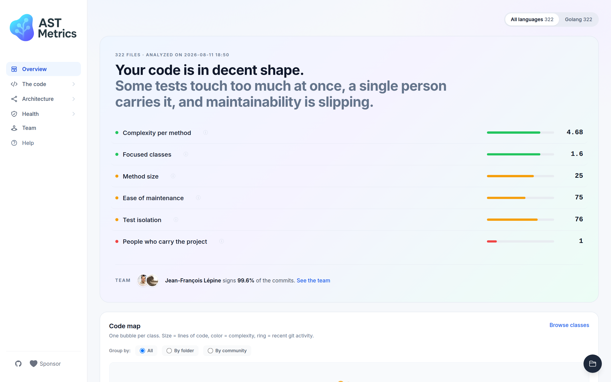
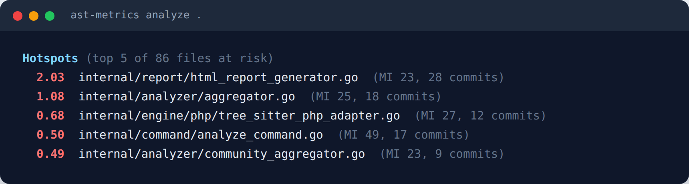

# Why AST Metrics?

!!! info "TL;DR"
    Just want to install? [Skip to Installation →](./install.md)

AST Metrics goes beyond simple linting. It uses **Abstract Syntax Trees (AST)** and **Component Graphs** to analyze your code from a mathematical perspective.

## From Code to Insights

By analyzing the relationships between every file, class, and function, AST Metrics extracts the **general architecture** of your project. It allows you to step back and see the big picture.

It helps you answer critical questions:

- **Architecture**: Is my code structured as I expect? Are there hidden dependencies?
- **Risk**: Which parts of the code are most likely to break?
- **Coupling**: How entangled are my components?

## How it works

1.  **Parse**: It reads your source code and builds an AST for each file.
2.  **Graph**: It connects all components (classes, functions) to build a dependency graph.
3.  **Analyze**: It applies graph theory and mathematical models to find patterns, clusters, and anomalies.

??? tip "Also available as a CLI tool"
    AST Metrics can also be used directly in your terminal for quick analysis or CI/CD pipelines: `ast-metrics analyze` prints a summary ending with the hotspots worth refactoring first.

    

## Key Benefits

- **Language-agnostic**: seven languages, analyzed the same way (see below).
- **Standalone**: No complex setup, databases, or servers required. Just a single binary.
- **Fast**: Written in Go for high performance on large codebases.

## Supported languages

Every metric is computed identically across languages, so a polyglot repository gives
you a single, comparable picture.

| Language | Versions |
|---|---|
| Golang | any version |
| PHP | up to PHP 8.5 |
| Python | Python 2 and 3 |
| TypeScript | any version |
| Rust | any version |
| Java | any version |
| C# | any version |

Files are picked up by extension. If your project uses unusual ones, declare them
with the matching flag (`--php-extensions=.inc,.module`, `--go-extensions`, and so
on).