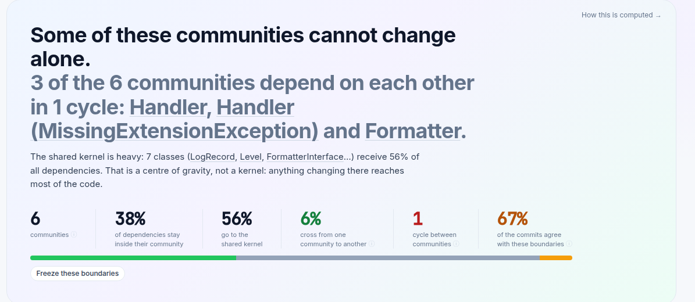
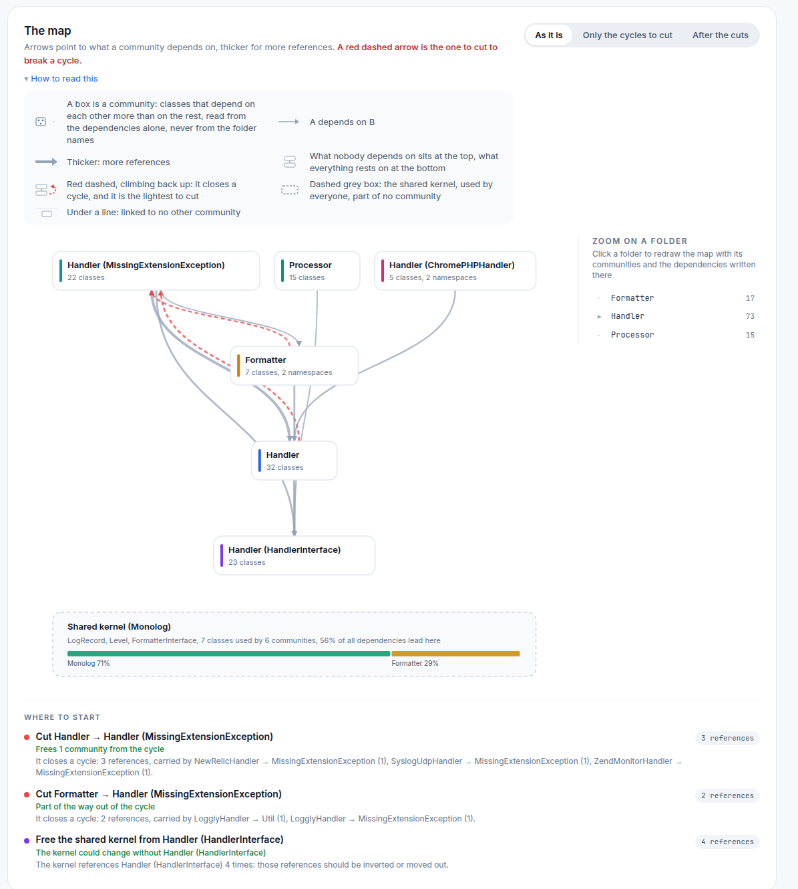

# Architecture Map

Every team has two architectures: the one on the whiteboard and the one in
the code. AST Metrics draws the second one and answers the question: **does my
system actually have the shape I believe it has?** Not with a diagram to
decipher, but with a verdict in plain words, a map, and the first three moves
to make.

Generate the report and open the **Architecture → Natural groups** page:

```bash
ast-metrics analyze --report-html=report --open-html .
```

## Start with the verdict

The page opens with a sentence, not a chart. On
[Monolog](../getting-started/your-first-analysis.md), it reads:



Everything in that sentence is computed, and everything is clickable: the
names link to the communities they describe. Under it, five numbers summarize
the whole structure:

- **6 communities**: the groups the classes actually form on the dependency
  graph, found without ever reading a folder name.
- **38% / 56% / 6%**: where dependencies go. Inside their own community
  (healthy), to the **shared kernel** (expected, unless it grows into a
  centre of gravity, as it has here), or **crossing** from one community to
  another (the share to watch: amber above 15%).
- **1 cycle**: communities that need each other to compile, so none of them
  can be understood, tested or extracted alone.
- **67% of commits agree**: the git history read against the boundaries. When
  most commits stay inside one community, the structure matches how the team
  actually works.

Even one of the most respected PHP codebases in the world gets findings.
That's the point: the goal is not a trophy, it's knowing where the structure
and the work disagree.

## Read the map



The map draws communities, not classes, and the layout carries the meaning:

- **What nobody depends on sits at the top, what everything rests on sits at
  the bottom.** The vertical order is computed from the arrows alone. If your
  layers exist, you'll see strata; if everything sits at the same level,
  everything depends on everything.
- **A red dashed arrow climbing back up closes a cycle**, and it's chosen as
  one of the lightest to cut. The toggles show the graph **as it is**, **only
  the cycles to cut**, or **after the cuts**.
- **The dashed grey box is the shared kernel**: the classes everyone uses
  (`LogRecord`, `Level`, ...), set apart so they don't glue unrelated
  communities together.
- **Zoom on a folder** redraws the map inside any folder, as if it were the
  whole project. Useful when the top-level map says "fine" but one module
  feels wrong.

## Then do something about it

Under the map, **Where to start** turns the analysis into a short ranked
list. On Monolog: cut `Handler → Handler (MissingExtensionException)`, 3
references carried by three named classes, and one community leaves the
cycle. Each action names the exact dependencies to break and what you gain.
The **What stands out** tab goes further: each finding is one observation
(a cycle, a folder split across communities, two communities the same
commits keep touching, a kernel that depends on its users), with the numbers
behind it.

[Community Detection](community-detection.md) documents how all of this is
computed: the Louvain detection, the kernel criteria, every finding and every
threshold.

## Freeze the shape you want

Seeing the drift is half the job; blocking it is one rule away. Three
[project rules](../ci/linting-architecture.md) guard the boundaries:

```yaml
requirements:
  rules:
    architecture:
      no_community_cycles: true
      max_community_cross_share: 20
      no_cross_community_dependencies: true
```

The last one fails on *every* crossing, so it's meant to be frozen once:

```bash
ast-metrics baseline
```

Today's crossings are accepted; from now on, only a **new** crossing fails
`ast-metrics lint`. Your architecture stops degrading silently, and legacy
code never blocks a build.

## The other two views

- **Architecture → Dependencies**: the same truth at file level. The graph of
  who imports whom, circular chains, the "handle with care" files that
  everything depends on.
- **Architecture → Roles**: an optional AI classification of each class's
  role in the system. It runs locally and only when you pass
  `--architecture` to `ast-metrics analyze`.
