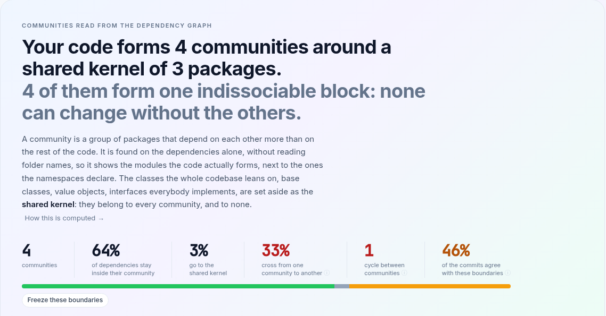
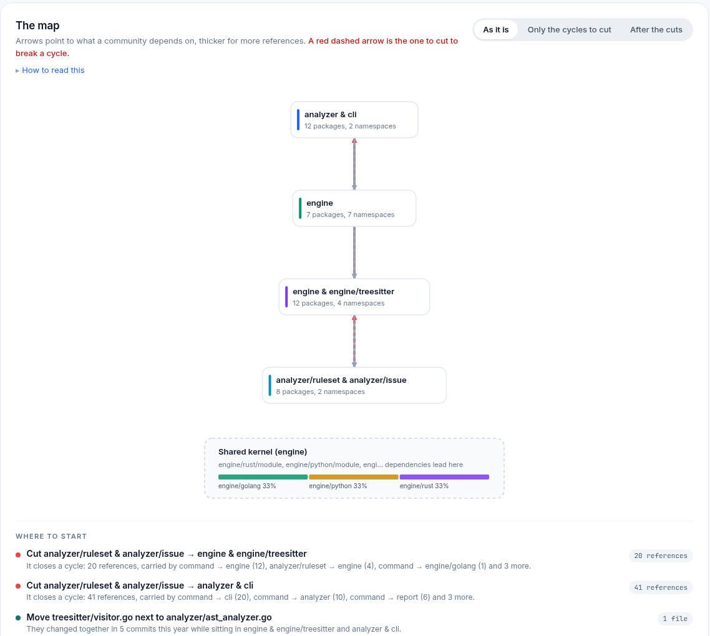
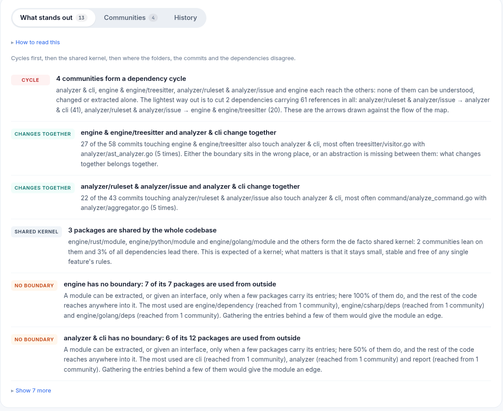
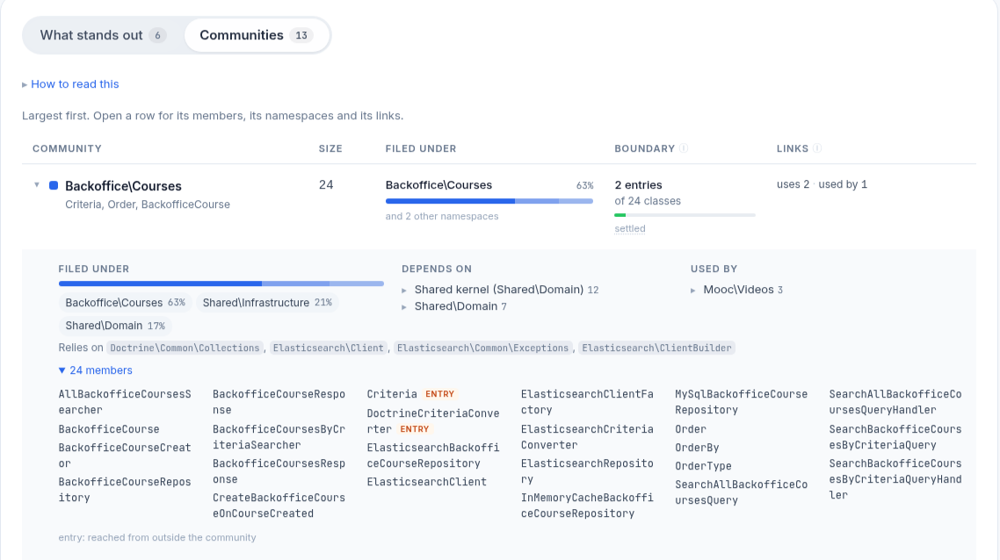
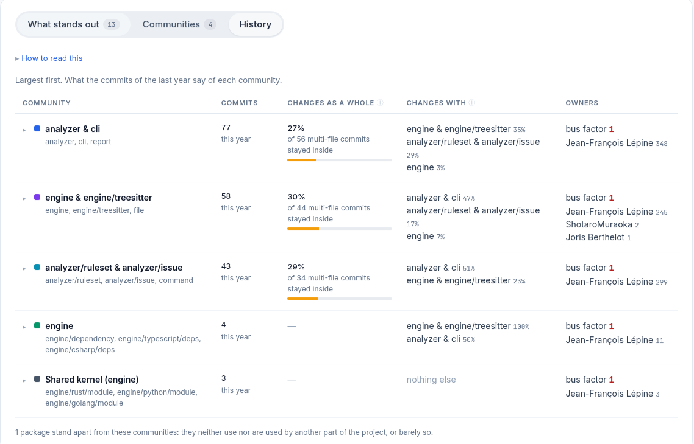

# Community Detection

A **community** is a group of classes (or packages) that depend on each other
more than on the rest of the code. AST Metrics finds them on the dependency
graph alone, without reading folder names, so the page shows the modules the
code actually forms next to the ones the namespaces declare. It is the
**Natural groups** page of the HTML report, under Architecture.

## What a community is

**Units.** In PHP, Java, C#, TypeScript and Python that imports names, a unit
is a class (or interface); a file holding only top-level code counts as a unit
of its own. In Go, Rust and any language whose imports name modules rather
than classes, a unit is a package: the granularity is decided per language on
what its dependencies name. Only the project's own code takes part: foreign
packages are not units (the row panel lists them under "Relies on"), test
files are left out, and so is anything under a test support directory
(`test`, `tests`, `__tests__`, `spec`, `fixtures`, `testdata`, `stubs`,
`mocks`, and so on). An edge from A to B is weighted by the number of distinct
places in A where B is used.

**The shared kernel.** Some units are used by everyone: a base class, a value
object, an interface everybody implements. Left in the graph, they would land
in one community by chance and tie it to all the others. A unit is set aside
in the kernel when at least 3 units from at least 3 namespaces use it, it
receives at least 3 references, and at most 15% of the pairs of its users
know each other (that last condition tells a kernel from the heart of a
feature: an entity used by its repository, its controller and its form is used
from several namespaces too, but those three know each other). The kernel is
only looked for when the project has at least 4 namespaces. It belongs to
every community and to none, takes no part in the cycles, and a reference to
it never counts as a crossing.

**How the communities are found.** The kernel is taken out first, then a
weighted [Louvain](https://en.wikipedia.org/wiki/Louvain_method) detection
runs on the remaining graph at resolution 1. The implementation is
deterministic: nodes are visited in the order of their ids and ties are broken
the same way every time, so two runs on the same code draw the same map.
Communities of fewer than 3 units are folded into the neighbour they exchange
the most with (two classes are a pair, not a module); a small group linked to
nothing stays apart and is counted with the units that take no part.
Communities are numbered largest first. One is named after its namespace
when that namespace holds at least half of its members; otherwise after the
word its class names share (`Billing`, `Repository`), joined to the dominant
namespace when that word names a layer (`Repository · Component\Scm`), and
failing that after the class at its heart. A community drawn at least 75%
from one namespace is called **cohesive**.

## Reading the page



**The verdict** is one sentence: how many communities the code forms, around a
shared kernel of how many units, followed by the one thing that qualifies it,
in this order of priority: cycles (one cycle holding at least 4 communities and
at least 34% of them is called "one indissociable block"), a kernel that is the
centre of gravity (at least 25% of the dependencies lead to it, or it holds at
least 10% of the units), then whether the communities stay inside their
namespaces or cut across them.

**The KPIs** split every dependency between placed units into three shares
that add up to 100%: the ones staying **inside** a community, the ones going
to the **kernel**, the ones **crossing** from one community to another. The
cross share turns amber above 15% and red above 30%; it is also amber when a
cycle holds 4 communities or more, because a low figure means little when the
communities cannot be told apart. **Cycles** counts the groups of communities
that reach each other. **History agrees** is the share of the commits of the
last year touching several files whose files all sit in one community, the
kernel allowed: green from 70%, amber from 40%.



**The map.** Arrows point to what a community depends on, thicker for more
references. What nobody depends on sits at the top, what everything rests on
at the bottom. A **red dashed arrow climbing back up** closes a cycle, and it
is one of the lightest to cut: they are chosen by a greedy heuristic that
orders the communities of each cycle and marks the arrows going against that
order. The dashed grey box is the shared kernel; the boxes under a line are
linked to no other community. When there are cycles, three views are offered:
**As it is**, **Only the cycles to cut**, and **After the cuts**, which hides
the red arrows and says how many layers are left without them. The panel on
the right zooms on a folder: every folder holding at least 6 units (300
folders at most) is analysed on its own, as if it were the whole project.

**Where to start** lists at most three actions derived from the findings, the
most valuable first: **cut** a back edge (the two lightest at most, with the
references that carry it), **move** a file next to the one it keeps changing
with, **gather** the entries of the most exposed community behind its three
most used members, **invert** the references the kernel makes into the
community it uses the most.

## What stands out



The first tab lists the findings, most important first: cycles, then what the
history says, then the kernel, then where the folders and the dependencies
disagree. At most 5 findings of each kind, 3 for the history ones. The pill
says which kind:

- **cycle**: communities that reach each other. For a pair, the lighter
  direction is the one to cut; for a longer cycle, the detail names the back
  edges and their total weight.
- **changes together**: two communities the same commits keep touching, at
  least 5 shared commits making at least 30% of the commits of the less active
  one, with the pair of files most often changed together. What changes
  together belongs together: either the boundary sits in the wrong place, or
  an abstraction is missing.
- **never as a whole**: a community of at least 5 units, touched by at least
  20 commits, where fewer than 10% of the multi-file commits stayed inside it.
  The dependencies group these units, the work does not.
- **shared kernel**: the units set aside, how many communities lean on them
  and what share of the dependencies lead there. Expected of a kernel; the
  finding changes tone when the kernel is the centre of gravity.
- **kernel leak**: the kernel depends on the code that uses it. A kernel that
  knows its users cannot change without them: those references should be
  inverted or moved out.
- **no boundary**: a community of at least 5 units where at least half of the
  members are used from outside. Nothing acts as its entry, so it cannot be
  extracted or given an interface as it is.
- **split folder**: a namespace of at least 6 units whose members fall in at
  least 3 communities, none holding half of them. The folder gathers several
  concerns rather than one module.
- **spread**: a community of at least 5 units drawn from several namespaces,
  none holding 75% of it. One module filed in several places, or one namespace
  leaking into the others.
- **layers**: when half or more of the communities are not cohesive, the
  spread findings are replaced by one observation about the whole project.
  When the namespaces are named after technical layers (Controller, Entity,
  Repository...), the communities are the features running through them; the
  finding says so and notes that a layout by feature would file each community
  together.
- **bridge**: a unit, outside the kernel, that exchanges references with at
  least 2 other communities. It is a de facto contract between them and its
  interface deserves to be explicit.

## The communities table



The **Communities** tab lists them largest first, the kernel last. **Filed
under** shows the namespace holding most of the members with its share, and
how many other namespaces contribute. **Boundary** counts the **entries**: the
members referenced from another community or from the kernel, the surface the
community offers to the rest of the code. The bar is green up to 25% of the
members, amber up to 50%, red beyond. Under it, **settled** means at least 90%
of the members stay put when the detection is tuned differently; otherwise the
cell says how many are **mobile**. To tell them, the detection is run four
more times, at resolutions 0.7, 0.85, 1.2 and 1.4; a member that sided with
another community in at least one run sits on the border. The kernel has no
boundary: it is exposed by definition.

Open a row for its detail: every namespace it draws from, what it **depends
on** and what it is **used by** with the five heaviest class-to-class
references behind each link, the foreign packages it relies on, and its
members. An **entry** tag marks the members reached from outside; a dotted
name is a mobile member.



When the files carry git history, the **History** tab reads the same table
from the commits of the last year. **Commits** is the number of distinct
commits touching at least one file of the community. **Changes as a whole** is
the share of the multi-file commits touching the community that stayed inside
it, the kernel allowed; it is left blank under 5 such commits. **Changes with**
lists the other communities the same commits touch, with the share of this
community's commits they take. **Owners** gives the bus factor, the number of
people who together made half of the commits, and the three heaviest
committers. Commits touching more than 30 analysed files are ignored as bulk
changes.

## Freezing the boundaries

Three project rules read the analysis in `ast-metrics lint` and `ast-metrics
ci`. All three pass when the project has fewer than two communities.

```yaml
requirements:
  rules:
    architecture:
      no_community_cycles: true
      max_community_cross_share: 20
      no_cross_community_dependencies: true
```

- **`no_community_cycles`** fails once for each cycle, naming its communities
  and up to three arrows to cut, lightest first:
  `Communities depend on each other: A, B; to cut: B → A (2)`.
- **`max_community_cross_share`** takes a percentage and fails when the cross
  share of the KPIs goes over it:
  `Too many dependencies cross between communities: 33% (max: 20%)`.
- **`no_cross_community_dependencies`** fails once for every reference from a
  unit of one community to a unit of another, the kernel left aside. On its
  own it is unusable on an existing project; it is meant to be frozen:

```bash
ast-metrics baseline
```

`ast-metrics baseline` writes today's crossings into
`.ast-metrics-baseline.yaml`; from then on `ast-metrics lint` ignores them and
fails only on a crossing added since. Each violation is filed under the file
declaring the unit that depends, with the message
`Foo depends on Bar, which sits in another community`. The message carries no
community name, id or weight on purpose: a community is renamed as soon as its
hub moves, and the baseline recognizes an entry by rule, file and message, so
only stable text may reach it. The two class names are what identifies a
crossing.

The report shows the state of that rule under the KPIs: **Freeze these
boundaries** with the snippet above when the rule is off, **Boundaries
watched, not frozen yet** with the number of crossings failing the lint when
it is on without a baseline, and **Boundaries frozen** with the number of
crossings in the baseline and how many are new since.

See [Rulesets & Linting](../ci/linting-architecture.md) for the rest of the
configuration.

## Getting the data

The JSON report (`--report-json`) carries the whole analysis under the
`communities` key: `verdict`, `granularity` (`class` or `namespace`),
`communitiesCount`, `largestSize`, `unitsGrouped`, `unitsIsolated`,
`internalShare`, `sharedShare`, `crossShare`, `modularity`, `confidence`,
`largestCycle`, `cohesiveCount`, `historyAvailable`, `historyCommits`,
`historyAgreement`, then `communities`, `edges`, `cycles`, `findings` and
`actions`. Each community lists its `id`, `name`, `shortName`, `shared`,
`size`, `cohesive`, `namespaces`, `hubs`, `members`, `uses` and `usedBy` with
their `references` and `details`, `externals`, `internalReferences`,
`outboundReferences`, `inboundReferences`, `exposedCount`, `exposedShare`,
`exposed`, `foreignUsesCount`, `border`, `confidence`, `busFactor`,
`topCommitters`, `historyCommits`, `historyCohesion` and `changesWith`. Each
edge carries `from`, `to`, `references`, `inCycle`, `back` and `shared`. Ids
are `"0"`, `"1"`, ... largest first, and `"shared"` for the kernel.

The [MCP server](../ai/mcp-server.md) exposes the same payload through
`get_communities`. By default it lists the hubs of each community only;
`with_members: true` adds every member, the entries and the border, and
`force_refresh: true` ignores the cache.

## Limits

- **One year of history.** The git analysis reads the commits of the last
  year only. A community that was written and then left alone shows as
  untouched, and "changes together" can only be judged on active code.
- **Packages are coarser than classes.** In Go and Rust the units are packages,
  so a project of a dozen packages forms a handful of communities and the
  findings speak of packages. The class-level reading needs a language whose
  imports name classes.
- **A community is a reading, not a truth.** Louvain optimises modularity, and
  another resolution draws slightly different borders: that is what the mobile
  members and the confidence make visible. The thresholds above (3 units, 75%
  cohesion, 50% exposed, 5 shared commits...) are choices; read the figures
  behind each finding before acting on it, and prefer the settled communities
  and the heaviest links when deciding where a boundary should go.
